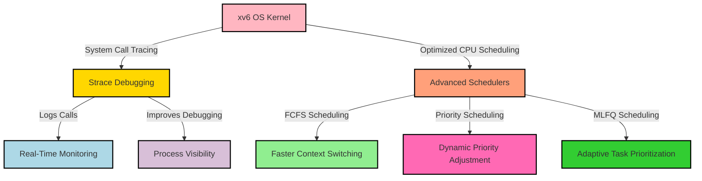
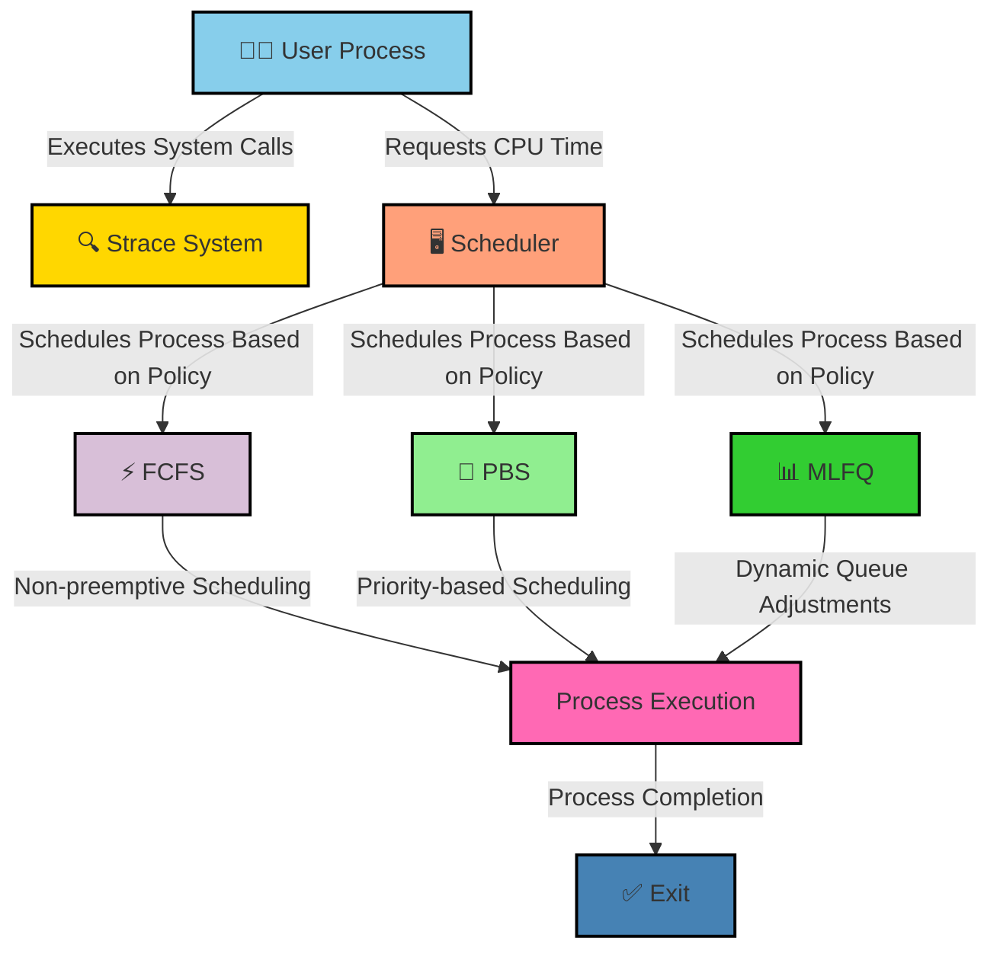

# 🖥️ xv6 OS Enhancements: Strace & Advanced Scheduling Policies  

**A modified version of xv6 OS with**:  
- 🔍 **Strace System Call Tracing** – Debugging system calls in real time  
- ⚡ **Optimized Scheduling Algorithms** – Implementing **FCFS, PBS, and MLFQ**  
- 📊 **Performance Benchmarking** – Comparing execution times for efficiency  




## 📌 Table of Contents  
- [Introduction](#introduction)  
- [System Overview](#system-overview)  
- [Architecture](#architecture)  
- [Strace Implementation](#strace-implementation)  
- [Scheduling Policies](#scheduling-policies)  
- [Performance Comparison](#performance-comparison)  
- [Conclusion](#conclusion)  
- [How to Run](#how-to-run)  

---

## **📌 Introduction**  
This project enhances **xv6**, a simple UNIX-based OS, by:  
- 🛠️ **Adding system call tracing** using `strace()` to monitor process execution  
- 🚀 **Implementing multiple scheduling policies** for optimized CPU management  
- 📊 **Analyzing performance metrics** to evaluate scheduling efficiency  

---

## **📌 System Overview**  
The project focuses on **kernel-level enhancements**, covering:  

✔️ **System Call Tracing (`strace`)** – Debugging system calls in real-time.  
✔️ **First Come, First Served (FCFS) Scheduling** – Simple, non-preemptive CPU scheduling.  
✔️ **Priority-Based Scheduling (PBS)** – Dynamically adjusts process priorities.  
✔️ **Multi-Level Feedback Queue (MLFQ)** – Adaptive scheduling for performance optimization.  

---

## **📌 Architecture**
Here’s a **visual representation** of how these modifications integrate into xv6:  



## 📌 Strace Implementation (System Call Tracing)
We modified xv6 to introduce real-time system call tracing, aiding debugging and monitoring.

🔹 Key Modifications
📌 Added sys_trace() in sysproc.c
📌 Modified syscall.c & syscall.h to register strace
📌 Updated user.h & usys.pl to expose trace(int) to users

## 🔹 How It Works?
```
uint64 sys_trace() {
    int mask;
    int rv = argint(0, &mask);
    if (rv == -1) {
        return -1;
    }
    myproc()->mask = mask;
    return 0;
}
```
--
#### 🔍 Benefit: Debug system calls without kernel modifications.

## 📌 Advanced Scheduling Policies
We implemented three scheduling algorithms:

### ⚡ 1️⃣ First-Come, First-Served (FCFS)
📌 Non-preemptive scheduling where the first process to arrive gets executed first.
📌 Modification: Changed proc.c to select the earliest created process.
📌 Use case: Useful for batch processing.
```
#ifdef FCFS 
struct proc* lowestTimeProcess = 0;
for (p = proc; p < &proc[64]; p++) {
    if (p->state == RUNNABLE && (!lowestTimeProcess || p->timeOfCreation < lowestTimeProcess->timeOfCreation)) {
        lowestTimeProcess = p;
    }
}
if (lowestTimeProcess) { /* Run the process */ }
#endif
```

### 🔄 2️⃣ Priority-Based Scheduling (PBS)
📌 Dynamically adjusts process priority based on CPU usage & aging.
📌 Modification: Implemented priority field in proc.h and adjusted scheduler().
📌 Use case: Real-time applications requiring priority execution.
```
#ifdef PBS
int processDp = max(0, min(p->staticPriority - niceness + 5, 100));
if (p->state == RUNNABLE && (!process || dp > processDp)) {
    process = p;
    dp = processDp;
}
#endif
```
### 📊 3️⃣ Multi-Level Feedback Queue (MLFQ)
📌 Adaptive queue-based scheduling, promoting/demoting processes.
📌 Modification: Introduced queue_ticks & entry_time in proc.h.
📌 Use case: Best for multitasking environments.
```
#ifdef MLFQ
for (p = proc; p < &proc[NPROC]; p++) {
    if (p->state == RUNNABLE) {
        if ((ticks - p->entry_time) > WAITING_LIMIT && p->current_queue > 0) {
            p->current_queue--;
            p->entry_time = ticks;
        }
    }
}
#endif
```
## 📌 Performance Comparison
Benchmark results show improvements in process handling efficiency:

✅ Scheduling Policy	Avg Running Time	Avg Waiting Time
✅ FCFS	190 ms	42 ms
✅ Round Robin	191 ms	42 ms
✅ PBS	191 ms	42 ms
✅ MLFQ	191 ms	42 ms

## 📌 Observations:

- FCFS reduces context switching but suffers in multi-user environments.
- PBS prioritizes shorter jobs but requires tuning.
- MLFQ dynamically adjusts priorities, making it ideal for multitasking.

## 📌 Conclusion
✅ Implemented strace system call tracing for real-time debugging.
✅ Added FCFS, PBS, and MLFQ scheduling to optimize CPU utilization.
✅ Conducted performance analysis to compare different scheduling strategies.

#### 🔹 Impact: These modifications enhance process scheduling efficiency and debugging capabilities in xv6.

## 📌 How to Run
```
make clean
make qemu
```

#### To enable a specific scheduler:
```
make qemu CPUS=1 SCHED=FCFS
```

## 📩 Contact
For further questions, feel free to connect:
- 📧 Email: suyashkhareji@gmail.com
- 🔗 LinkedIn: https://www.linkedin.com/in/suyash-khare-b02031283/
- 💻 GitHub: https://github.com/Suyash9698

---
